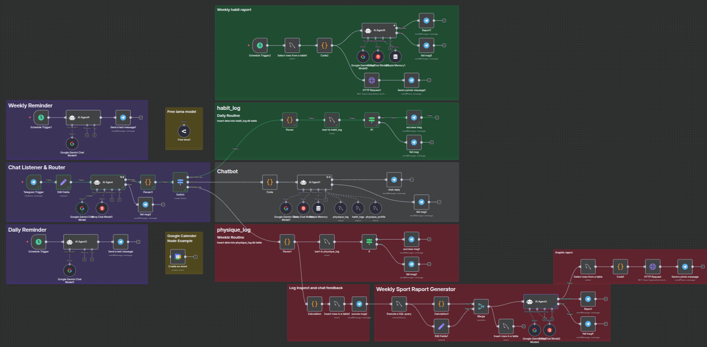
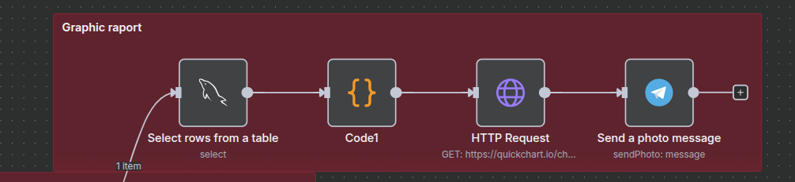

# 🤖 PersonalProgressAI (PPAI)

A comprehensive personal progress tracking system built with n8n that uses AI to monitor daily habits, physical measurements, and provides intelligent chat-based interaction through Telegram.


*Complete n8n workflow architecture showing all interconnected components for habit tracking, physical monitoring, AI chat, and automated reporting*

## 📋 Table of Contents

- [🌟 Features](#-features)
- [🏗️ Architecture](#️-architecture)
- [📸 Workflow Components](#-workflow-components)
- [🚀 Quick Setup Guide](#-quick-setup-guide)
- [📱 Usage](#-usage)
- [🔧 Technical Implementation](#-technical-implementation)
- [📊 Sample Interactions](#-sample-interactions)
- [🧩 Code Node Functions](#-code-node-functions)
- [🎯 Key Benefits](#-key-benefits)
- [🔮 Future Enhancements](#-future-enhancements)

## 🌟 Features

### 📊 **Multi-Modal Progress Tracking**
- **Daily Habit Logging**: Track study, project work, sports, and social activities
- **Physical Measurements**: Monitor weight, body measurements (waist, neck, hip, shoulder, chest)
- **Automated Calculations**: BMI, body fat percentage, and muscle mass calculations
- **Visual Reports**: Automatically generated charts and graphs

### 🤖 **AI-Powered Chat Assistant**
- **Intelligent Message Routing**: Automatically categorizes incoming messages
- **Natural Language Processing**: Understands different command formats
- **Conversational Interface**: Chat with "Abidin" - your personal AI assistant
- **Database Queries**: Ask questions about your progress data

### 📈 **Automated Reporting**
- **Daily Reminders**: Scheduled prompts for habit tracking
- **Weekly Assessments**: Comprehensive progress summaries
- **Visual Analytics**: Chart generation for progress visualization
- **Calendar Integration**: Google Calendar event creation

## 🏗️ Architecture

The workflow consists of several interconnected sections that work together to provide a comprehensive progress tracking system:

### Core Components

1. **Telegram Integration**
   - Message reception and processing
   - Photo and text responses
   - User interaction management

2. **AI Language Models**
   - Google Gemini for text processing and analysis
   - Groq (Llama models) for conversational AI
   - OpenRouter for additional AI capabilities

3. **Database Management**
   - MySQL database with three main tables:
     - `habit_logs`: Daily activity tracking
     - `physique_logs`: Physical measurement data
     - `physique_profile`: Weekly calculated summaries

4. **Visualization Engine**
   - QuickChart.io integration for graph generation
   - Dynamic chart creation for trends analysis

5. **Automation Layer**
   - Scheduled reminders and reports
   - Message routing and processing
   - Data validation and error handling

## 📸 Workflow Components

Here's a detailed breakdown of each workflow component with visual examples:

### 🔀 Message Router & Chat System

*Central message processing hub that analyzes incoming Telegram messages, categorizes them (habit logging, physical measurements, or chat), and routes them to appropriate workflow components. This is the brain of the system that decides how to handle each user interaction.*

### 🤖 AI Chat Assistant

*AI-powered conversational system using Google Gemini and Groq models. Provides intelligent responses to user queries, analyzes progress data, and maintains conversation context. Features memory management for personalized interactions.*

### 📝 Daily Habit Tracking

*Processes daily habit data (study, project, sport, social activities) from user input. Parses comma-separated values, validates data, and stores formatted records in the database with automatic date stamping.*

### 📏 Physical Measurements

*Handles body measurement logging including weight, height, waist, neck, hip, shoulder, and chest measurements. Automatically calculates BMI, body fat percentage, and muscle mass using scientific formulas.*

### ⏰ Automated Reminders

*Scheduled daily prompts sent via Telegram to encourage habit logging. Runs at predetermined times to remind users to track their daily activities and maintain consistency.*


*Weekly check-in system that prompts users for physical measurements and comprehensive progress review. Ensures regular monitoring of physical changes and long-term trends.*

### 📊 Report Generation

*Analyzes weekly habit data and generates comprehensive reports showing patterns, streaks, and areas for improvement. Provides AI-powered insights on habit consistency and recommendations.*


*Creates detailed physical progress reports combining measurement data with calculated health metrics. Tracks changes in BMI, body composition, and muscle development over time.*


*Chart generation system using QuickChart.io to create visual representations of progress data. Generates line charts for both habit tracking and physical measurements with multiple metrics displayed simultaneously.*

## 🚀 Quick Setup Guide

### Step 1: Prerequisites

Before setting up the workflow, ensure you have:
- n8n instance (cloud or self-hosted)
- MySQL database access
- Telegram account

### Step 2: Required API Keys

#### 🤖 **Telegram Bot** (Required)
1. Message [@BotFather](https://t.me/botfather) on Telegram
2. Send `/newbot` and follow instructions
3. Save your **Bot Token** (format: `123456789:ABCdefGHIjklMNOpqrsTUVwxyz`)
4. Get your **Chat ID**:
   - Send a message to your bot
   - Visit: `https://api.telegram.org/bot<YOUR_BOT_TOKEN>/getUpdates`
   - Find your chat ID in the response

#### 🧠 **Google Gemini API** (Required)
1. Go to [Google AI Studio](https://aistudio.google.com/)
2. Create a new API key
3. Save your **Gemini API Key**

#### 🗄️ **MySQL Database** (Required)
- Use any MySQL hosting service (AWS RDS, Google Cloud SQL, DigitalOcean, etc.)
- Or set up a local MySQL instance
- Note down: **Host, Port, Username, Password, Database Name**

#### ⚡ **Groq API** (Optional - for faster AI responses)
1. Sign up at [Groq Console](https://console.groq.com/)
2. Generate an API key
3. Save your **Groq API Key**

#### 📅 **Google Calendar API** (Optional)
1. Go to [Google Cloud Console](https://console.cloud.google.com/)
2. Enable Google Calendar API
3. Create OAuth2 credentials

### Step 3: Import Workflow

1. **Download the Workflow File**
   - Download `PersonalProgressAI-Samet.json` from this repository

2. **Import to n8n**
   - Open your n8n instance
   - Click **"Workflows"** → **"Import from file"**
   - Select the downloaded JSON file
   - Click **"Import"**

### Step 4: Configure Credentials

#### Telegram Bot Setup:
- Click on any Telegram node (red error indicator)
- Click **"Create New Credential"**
- Enter your **Bot Token**
- **Test & Save**

#### Google Gemini Setup:
- Click on "Google Gemini Chat Model" node
- Click **"Create New Credential"**
- Enter your **Gemini API Key**
- **Test & Save**

#### MySQL Database Setup:
- Click on any MySQL node
- Click **"Create New Credential"**
- Enter your database connection details
- **Test & Save**

### Step 5: Database Setup

Create the required tables in your MySQL database:

```sql
CREATE TABLE habit_logs (
  id INT AUTO_INCREMENT PRIMARY KEY,
  study BOOLEAN,
  project BOOLEAN,
  sport BOOLEAN,
  social BOOLEAN,
  note TEXT,
  date DATE,
  created_at TIMESTAMP DEFAULT CURRENT_TIMESTAMP
);

CREATE TABLE physique_logs (
  id INT AUTO_INCREMENT PRIMARY KEY,
  weight DECIMAL(5,2),
  height DECIMAL(5,2),
  waist DECIMAL(5,2),
  neck DECIMAL(5,2),
  hip DECIMAL(5,2),
  shoulder DECIMAL(5,2),
  chest DECIMAL(5,2),
  note TEXT,
  date DATE,
  created_at TIMESTAMP DEFAULT CURRENT_TIMESTAMP
);

CREATE TABLE physique_profile (
  id INT AUTO_INCREMENT PRIMARY KEY,
  weight DECIMAL(5,2),
  height DECIMAL(5,2),
  bmi DECIMAL(5,2),
  muscle_mass DECIMAL(5,2),
  body_fat_pct DECIMAL(5,2),
  date DATE,
  created_at TIMESTAMP DEFAULT CURRENT_TIMESTAMP
);
```

### Step 6: Personalization

1. **Update Chat ID** in all Telegram nodes:
   - Find nodes with `"chatId": "<YOUR_CHAT_ID>"`
   - Replace with your actual Chat ID

2. **Test & Activate**:
   - Save the workflow (Ctrl+S)
   - Activate the workflow (toggle switch)
   - Test: Send `-chat Hello! Are you working?` to your bot

## 📱 Usage

### Command Formats

#### 1. Daily Habit Logging (`-msg`)
```
-msg 1,1,0,1,today was productive
```
**Format**: `study,project,sport,social,note`
- `1` = activity completed
- `0` = activity not completed

#### 2. Physical Measurements (`-msr`)
```
-msr 75,180,80,38,95,110,100,feeling strong
```
**Format**: `weight(kg),height(cm),waist(cm),neck(cm),hip(cm),shoulder(cm),chest(cm),note`

#### 3. Chat Interaction (`-chat`)
```
-chat How has my progress been this week?
```
Free-form conversation with the AI assistant

### Automated Schedules

- **Daily Reminders**: Prompts for habit logging
- **Weekly Physical Check**: Requests for body measurements
- **Weekly Reports**: Comprehensive progress analysis with charts

## 🔧 Technical Implementation

### Database Schema

#### `habit_logs`
- `study`, `project`, `sport`, `social` (BOOLEAN)
- `note` (TEXT)
- `date` (DATE)
- `created_at` (TIMESTAMP)

#### `physique_logs`
- `weight`, `height`, `waist`, `neck`, `hip`, `shoulder`, `chest` (DECIMAL)
- `note` (TEXT)
- `date` (DATE)
- `created_at` (TIMESTAMP)

#### `physique_profile`
- `weight`, `height`, `bmi`, `muscle_mass`, `body_fat_pct` (DECIMAL)
- `date` (DATE)
- `created_at` (TIMESTAMP)

### AI Integration

- **Google Gemini**: Primary language model for text processing and analysis
- **Groq (Llama)**: Conversational AI for chat interactions
- **Memory Management**: Maintains conversation context across sessions

## 📊 Sample Interactions

### Daily Check-in
**Bot**: "Bugün ders çalıştın mı? Proje üzerinde çalıştın mı? Spor yaptın mı?"  
**User**: `-msg 1,1,0,1,productive day despite no sports`  
**Bot**: "Değerler database'e başarıyla kaydedildi. ✅"

### Weekly Assessment
**User**: `-chat How's my progress this week?`  
**Bot**: "Bu hafta çok iyisin hacı! Çalışma konusunda stabil gitmiş, sosyal tarafta da fena değil. Sadece sporu biraz ihmal etmişsin, ona biraz daha ağırlık ver derim."

### Physical Tracking
**User**: `-msr 75.5,180,82,36,96,112,102,feeling stronger`  
**Bot**: "Değerler database'e başarıyla kaydedildi. ✅"  
*[Followed by calculated BMI, body fat %, and muscle mass analysis]*

## 🧩 Code Node Functions

The workflow uses several custom JavaScript Code nodes for data processing:

### Data Parsing Functions

#### 1. **Parser** (Habit Log Parser)
- **Purpose**: Parses AI-generated habit tracking data
- **Function**: Extracts habit data (study, project, sport, social, note) from AI JSON output
- **Input**: JSON string with comma-separated values
- **Output**: Formatted habit log data for database storage

#### 2. **Parser1** (Physique Log Parser) 
- **Purpose**: Parses AI-generated physical measurement data
- **Function**: Extracts measurement values (weight, height, waist, neck, hip, shoulder, chest, note)
- **Input**: JSON string with comma-separated measurement values
- **Output**: Formatted physique log data for database storage

#### 3. **Parser3** (Navigation Parser)
- **Purpose**: Categorizes incoming messages and extracts routing information
- **Function**: Determines which workflow branch to route messages to (navigate)
- **Input**: AI categorization result JSON
- **Output**: Workflow routing information and cleaned message

#### 4. **Code** (Chat Message Parser)
- **Purpose**: Cleans and formats chat messages
- **Function**: Extracts clean chat responses from AI JSON code blocks
- **Input**: AI chat response in JSON code block format
- **Output**: Clean chat message text

### Mathematical Calculation Functions

#### 5. **Calculation** (Body Metrics Calculator)
- **Purpose**: Calculates health metrics from physical measurements
- **Functions**: 
  - BMI (Body Mass Index) calculation
  - Body fat percentage calculation (US Navy formula for males)
  - Muscle mass estimation
- **Formulas**:
  - BMI = weight(kg) / (height(m))²
  - Body Fat % = 495 / (1.0324 - 0.19077 × log10(waist-neck) + 0.15456 × log10(height)) - 450
  - Muscle Mass = (1 - body_fat_pct/100) × weight × 0.8
- **Input**: weight, height, waist, neck measurements
- **Output**: BMI, body fat %, muscle mass values

#### 6. **Calculation1** (Alternative Body Metrics)
- **Purpose**: Alternative calculation method for error handling
- **Function**: Safer parsing with same metric calculations
- **Input**: Physical measurement data
- **Output**: Calculated health metrics

### Data Visualization Functions

#### 7. **Code1** (Physique Chart Generator)
- **Purpose**: Creates physical progress charts
- **Functions**: 
  - Sorts weekly physique data chronologically
  - Prepares line chart format for QuickChart.io
  - Handles 4 metrics: Weight, BMI, Body Fat %, Muscle Mass
- **Input**: Physique profile database records
- **Output**: Chart.js format chart configuration

#### 8. **Code2** (Habit Chart Generator)
- **Purpose**: Creates habit tracking charts
- **Functions**:
  - Sorts weekly habit data chronologically
  - Creates line chart for 4 activities: Study, Project, Sport, Social
  - Converts boolean values (0/1) to chart format
- **Input**: Habit logs database records
- **Output**: Chart.js format weekly activity chart

### Key Features of Code Nodes:
- **Error Handling**: Try-catch blocks in all parsers
- **Data Validation**: safeParse functions for secure data conversion
- **Date Formatting**: ISO format date processing
- **Mathematical Precision**: toFixed() for decimal precision
- **Chart Integration**: QuickChart.io compatible JSON format

## 🎯 Key Benefits

- **Automated Tracking**: No manual spreadsheets or apps needed
- **AI-Powered Insights**: Intelligent analysis of your progress patterns
- **Conversational Interface**: Natural language interaction with your data
- **Visual Progress**: Automatic chart generation and trend analysis
- **Comprehensive Monitoring**: Both behavioral and physical metrics in one system
- **Personalized Feedback**: AI assistant provides contextual advice and motivation

## 🔮 Future Enhancements

- Sleep tracking integration
- Nutrition logging capabilities
- Goal setting and achievement tracking
- Multi-user support
- Advanced analytics and machine learning insights
- Mobile app companion

## 🔧 Troubleshooting

- **Bot not responding?** Check if the workflow is active and credentials are correct
- **Database errors?** Ensure tables exist and connection details are correct  
- **AI not working?** Verify your API keys and check rate limits
- **Wrong chat ID?** Double-check your Telegram Chat ID

Need help? Open an issue in this repository!

## 📝 License

This project is open source and available under the [MIT License](LICENSE).

## 🤝 Contributing

Contributions are welcome! Please feel free to submit a Pull Request.

## 📞 Support

For questions or support, please open an issue in this repository.

---

**Made with ❤️ using n8n automation platform**
